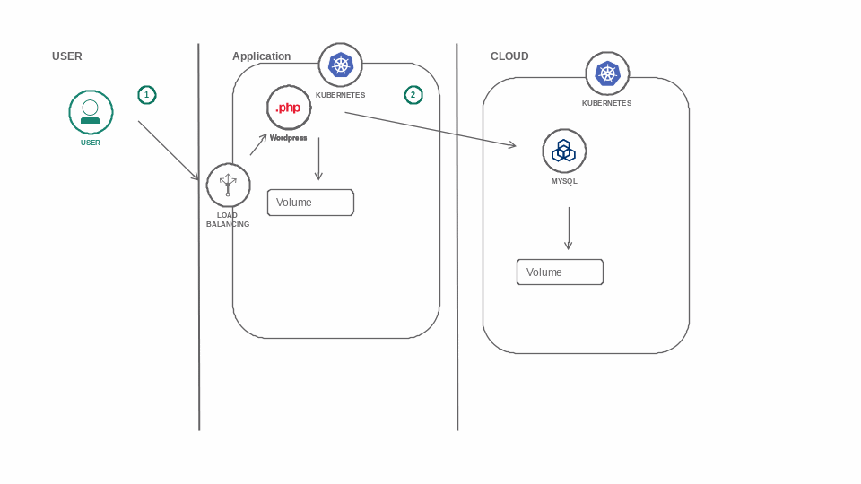

wordpress-twitch 10-5
=====================


Code from twitch cast from 10-5 on [ibmdeveloper](https://twitch.tv/ibmdeveloper)


Architechture;




Interesting bits:


```bash
kubectl get pod -l app=wordpress
kubectl get pod -l app=wordpress -o jsonpath='{.items[0].metadata.name}'
kubectl port-forward wordpress-5954ccb45c-74gwl 8080:80
kubectl run -it --image nibalizer/utilities debug2 /bin/bash
```
